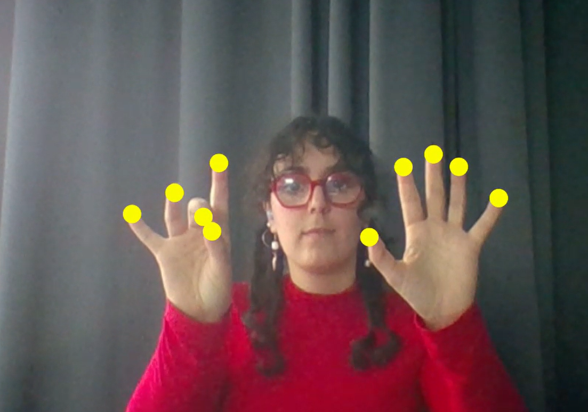

#Hands Music 
-> gesture need, si j'ai besoin de faire un truc avec les mains a ituliser 

## Code 
-> This is a collection od code created during the workshop with Douglas, in Folder>Hands, the original Folder with the hand tracer

I created a sound library for each finger. The sound is activated when the thumb touches a finger. You can add sounds together.

Interactive sketch that maps one sound per finger. Touching the thumb to any finger triggers that finger's sample; multiple fingers can be combined to create layered sounds.

